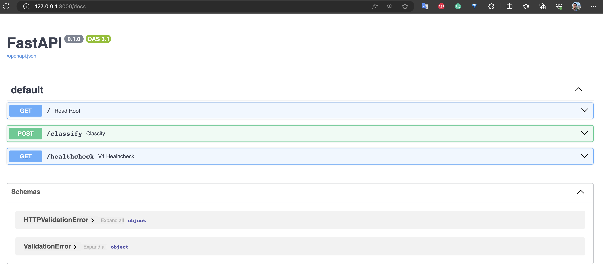
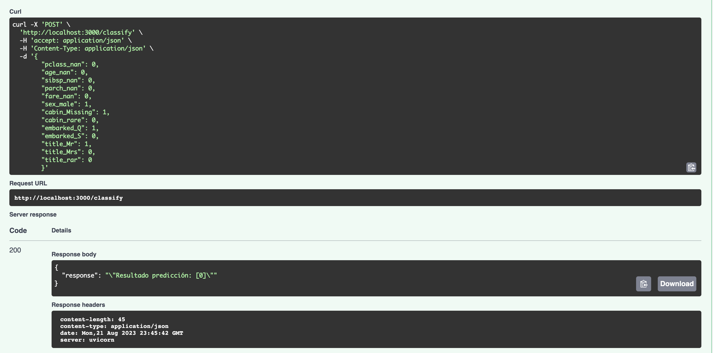
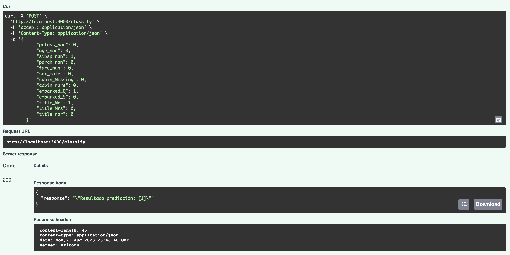

# ITESM MLOPs Project

## Introduction of the project

Welcome to the final project focused on MLOps, where the key concepts of ML frameworks and their application will be applied in a practical approach. Throughout this project, the basic concepts and fundamental tools for developing software in the field of MLOps are shown, covering everything from configuring the environment to best practices for creating ML models and deploying them.

## About the project

The overall goal of this project is to build a robust and reproducible MLOps workflow for developing, training, and deploying machine learning models. A linear regression model will be used as a proof of concept due to its simplicity, and it will be applied to the Titanic data set to predict the probability of survival of a passenger based on certain characteristics.

This project covers the following topics:

1. **Key concepts of ML systems**  
The objective of this module is to give an introduction to MLOps, life cycle and architecture examples is also given.

2. **Basic concepts and tools for software development**  
This module focuses on introducing the principles of software development that will be used in MLOps. Consider the configuration of the environment, tools to use, and best practices, among other things.

3. **Development of ML models**  
This module consists of showing the development of an ML model from experimentation in notebooks, and subsequent code refactoring, to the generation of an API to serve the model.

4. **Deployment of ML models**  
The objective of this module is to show how a model is served as a web service to make predictions.

5. **Integration of concepts**  
This module integrates all the knowledge learned in the previous modules. A demo of Continuous Delivery is implemented.

### Baseline

This MLOps project is focused on demonstrating the implementation of a complete workflow that ranges from data preparation to exposing a local web service to make predictions using a linear regression model. The chosen dataset is the famous Titanic dataset, which contains information about the Titanic passengers and whether or not they survived the disaster.

The purpose is to establish a starting point or "baseline" that will serve as a reference to evaluate future improvements and not only more complex algorithms but more complex components and further deployments.

### Scope

This project is planned to cover the topics seen in the course syllabus, which was designed to include technical capacity levels 0, 1 and a small part of 2 of [Machine Learning operations maturity model - Azure Architecture Center | Microsoft Learn](https://learn.microsoft.com/en-us/azure/architecture/example-scenario/mlops/mlops-maturity-model).

In other words, knowledge is integrated regarding the learning of good software development practices and Dev Ops (Continuous Integration) applied to the deployment of ML models.

### Links to experiments like notebooks

You can find the Titanic experiments here:

* [1-exploring-data.ipynb](docs/notebooks/1-exploring-data.ipynb)
* [2-organizing-ideas.ipynb](docs/notebooks/2-organizing-ideas.ipynb)
* [3-create-convenient-classes.ipynb](docs/notebooks/3-create-convenient-classes.ipynb)
* [4_creating_pipeline.ipynb](docs/notebooks/4_creating_pipeline.ipynb)
* [5_refactored_titanic_notebook.ipynb](docs/notebooks/5_refactored_titanic_notebook.ipynb)

## Setup

### Python version and packages to install

* Change the directory to the root folder.

* Create a virtual environment with Python 3.10+:

    ```bash
    python3.10 -m venv venv
    ```

* Activate the virtual environment

    ```bash
    source venv/bin/activate
    ```

* Install libraries
Run the following command to install the libraries/packages.

    ```bash
    pip install -r requirements.txt
    ```

## Model training from a main file

To train the Logistic Model, only run the following code:

```bash
python itesm_mlops_project/itesm_mlops_project.py
```

Output:

```bash
test roc-auc : 0.8152286743603835
test accuracy: 0.7748091603053435
Model saved in ./models/logistic_regression_output.pkl
```

## Execution of unit tests (Pytest)

### Test location

You can find the test location in the [test](tests) folder, and the following tests:

* Test `test_missing_indicator_transform`:  
Test the `transform` method of the MissingIndicator transformer.

* Test `test_missing_indicator_fit`:  
Test the `fit` method of the MissingIndicator transformer.

* Test `test_csv_file_existence`:  
Test case to check if the CSV file exists.

* Test `test_model_existence`:  
Test to validate the existence of a `.pkl` model file.

### Execution instructions

#### Test `Data Retriever` class

The following test validates the [load_data.py](itesm_mlops_project/load/load_data.py) module, with the `DataRetriever` class.

Follow the next steps to run the test.

* Run in the terminal:

    ```bash
    pytest ./tests/test_itesm_mlops_project.py::test_csv_file_existence -v
    ```

* You should see the following data output:

    ```pytest
    =========================================== test session starts ===========================================
    platform darwin -- Python 3.10.12, pytest-7.4.0, pluggy-1.2.0 -- /Users/carloslme/Documents/GitHub/itesm-mlops-project/venv/bin/python3.10
    cachedir: .pytest_cache
    rootdir: /Users/carloslme/Documents/GitHub/itesm-mlops-project
    plugins: anyio-3.7.1
    collected 1 item                                                                                          

    tests/test_itesm_mlops_project.py::test_csv_file_existence PASSED                                   [100%]

    ============================================ 1 passed in 1.76s ============================================
    ```

#### Test `MissingIndicator` class - `transform` method

The following test validates the [preprocess_data.py](itesm_mlops_project/preprocess/preprocess_data.py) module, with the `MissingIndicator` class in the `transform` method.

Follow the next steps to run the test.

* Run in the terminal:

    ```bash
    pytest ./tests/test_itesm_mlops_project.py::test_missing_indicator_transform -v
    ```

* You should see the following data output:

    ```pytest
    ==================================================================== test session starts =====================================================================
    platform darwin -- Python 3.10.12, pytest-7.4.0, pluggy-1.2.0 -- /Users/carloslme/Documents/GitHub/itesm-mlops-project/venv/bin/python3.10
    cachedir: .pytest_cache
    rootdir: /Users/carloslme/Documents/GitHub/itesm-mlops-project
    plugins: anyio-3.7.1
    collected 1 item                                                                                                                                             

    tests/test_itesm_mlops_project.py::test_missing_indicator_transform PASSED                                                                             [100%]

    ===================================================================== 1 passed in 0.77s ======================================================================
    ```

#### Test `MissingIndicator` class - `fit` method

The following test validates the [preprocess_data.py](itesm_mlops_project/preprocess/preprocess_data.py) module, with the `MissingIndicator` class in the `fit` method.

Follow the next steps to run the test.

* Run in the terminal:

    ```bash
    pytest ./tests/test_itesm_mlops_project.py::test_missing_indicator_fit -v
    ```

* You should see the following data output:

    ```pytest
    =========================================== test session starts ===========================================
    platform darwin -- Python 3.10.12, pytest-7.4.0, pluggy-1.2.0 -- /Users/carloslme/Documents/GitHub/itesm-mlops-project/venv/bin/python3.10
    cachedir: .pytest_cache
    rootdir: /Users/carloslme/Documents/GitHub/itesm-mlops-project
    plugins: anyio-3.7.1
    collected 1 item                                                                                          

    tests/test_itesm_mlops_project.py::test_missing_indicator_fit PASSED                                [100%]

    ============================================ 1 passed in 0.73s ============================================
    ```

#### Test model existence

The following test validates the model's existence after the training.

Follow the next steps to run the test.

* Run in the terminal:

    ```bash
    pytest ./tests/test_itesm_mlops_project.py::test_model_existence -v -s
    ```

* You should see the following data output:

    ```pytest
    =========================================== test session starts ===========================================
    platform darwin -- Python 3.10.12, pytest-7.4.0, pluggy-1.2.0 -- /Users/carloslme/Documents/GitHub/itesm-mlops-project/venv/bin/python3.10
    cachedir: .pytest_cache
    rootdir: /Users/carloslme/Documents/GitHub/itesm-mlops-project
    plugins: anyio-3.7.1
    collected 1 item                                                                                          

    tests/test_itesm_mlops_project.py::test_model_existence itesm_mlops_project/models/logistic_regression_output.pkl
    PASSED

    ============================================ 1 passed in 0.79s ============================================
    ```

## Usage

### Individual Fastapi and Use Deployment

* Run the next command to start the Titanic API locally

    ```bash
    uvicorn itesm_mlops_project.api.main:app --reload
    ```

#### Checking endpoints

1. Access `http://127.0.0.1:8000/`, you will see a message like this `"Titanic is all ready to go!"`
2. Access `http://127.0.0.1:8000/docs`, the browser will display something like this:

3. Try running the following predictions with the endpoint by writing the following values:
    * **Prediction 1**  
        Request body

        ```bash
        {
        "pclass_nan": 0,
        "age_nan": 0,
        "sibsp_nan": 0,
        "parch_nan": 0,
        "fare_nan": 0,
        "sex_male": 1,
        "cabin_Missing": 1,
        "cabin_rare": 0,
        "embarked_Q": 1,
        "embarked_S": 0,
        "title_Mr": 1,
        "title_Mrs": 0,
        "title_rar": 0
        }
        ```

        Response body
        The output will be:

        ```bash
        "Resultado predicción: [0]"
        ```

    * **Prediction 2**  
        Request body

        ```bash
         {
            "pclass_nan": 0,
            "age_nan": 0,
            "sibsp_nan": 1,
            "parch_nan": 0,
            "fare_nan": 0,
            "sex_male": 0,
            "cabin_Missing": 0,
            "cabin_rare": 0,
            "embarked_Q": 1,
            "embarked_S": 0,
            "title_Mr": 1,
            "title_Mrs": 0,
            "title_rar": 0
        }
        ```

        Response body
        The output will be:

        ```bash
        "Resultado predicción: [1]"
        ```

### Individual deployment of the API with Docker and usage

#### Build the image

* Ensure you are in the `itesm-mlops-project/` directory (root folder).
* Run the following code to build the image:

    ```bash
    docker build -t titanic-image ./itesm_mlops_project/app/
    ```

* Inspect the image created by running this command:

    ```bash
    docker images
    ```

    Output:

    ```bash
    REPOSITORY      TAG       IMAGE ID       CREATED       SIZE
    titanic-image   latest    bb48551cf542   2 hours ago   500MB
    ```

#### Run Titanic REST API

1. Run the next command to start the `titanic-image` image in a container.

    ```bash
    docker run -d --rm --name titanic-c -p 8000:8000 titanic-image
    docker run -d --rm --name frontend-c -p 3000:5000 frontend-img
    ```

2. Check the container running.

    ```bash
    docker ps -a
    ```

    Output:

    ```bash
    CONTAINER ID   IMAGE           COMMAND                  CREATED          STATUS          PORTS                    NAMES
    53d78fb5223f   titanic-image   "uvicorn main:app --…"   19 seconds ago   Up 18 seconds   0.0.0.0:8000->8000/tcp   titanic-c
    ```

#### Checking endpoints

1. Access `http://127.0.0.1:8000/`, and you will see a message like this `"Titanic classifier is all ready to go!"`
2. A file called `main_api.log` will be created automatically inside the container. We will inspect it below.
3. Access `http://127.0.0.1:8000/docs`, the browser will display something like this:
    

4. Try running the following predictions with the endpoint by writing the following values:
    * **Prediction 1**  
        Request body

        ```bash
        {
        "pclass_nan": 0,
        "age_nan": 0,
        "sibsp_nan": 0,
        "parch_nan": 0,
        "fare_nan": 0,
        "sex_male": 1,
        "cabin_Missing": 1,
        "cabin_rare": 0,
        "embarked_Q": 1,
        "embarked_S": 0,
        "title_Mr": 1,
        "title_Mrs": 0,
        "title_rar": 0
        }
        ```

        Response body
        The output will be:

        ```bash
        "Resultado predicción: [0]"
        ```

        

    * **Prediction 2**  
        Request body

        ```bash
         {
            "pclass_nan": 0,
            "age_nan": 0,
            "sibsp_nan": 1,
            "parch_nan": 0,
            "fare_nan": 0,
            "sex_male": 0,
            "cabin_Missing": 0,
            "cabin_rare": 0,
            "embarked_Q": 1,
            "embarked_S": 0,
            "title_Mr": 1,
            "title_Mrs": 0,
            "title_rar": 0
        }
        ```

        Response body
        The output will be:

        ```bash
        "Resultado predicción: [1]"
        ```

        

#### Opening the logs

1. Run the command

    ```bash
    docker exec -it titanic-c bash
    ```

    Output:

    ```bash
    root@53d78fb5223f:/# 
    ```

2. Check the existing files:

    ```bash
    ls
    ```

    Output:

    ```bash
    Dockerfile   bin   etc   main.py       ml_models  opt        requirements.txt  sbin  tmp README.md    boot  home  main_api.log  mnt    predictor  root   srv   usr __pycache__  dev   lib   media         models     proc       run     sys   var
    ```

3. Open the file `main_api.log` and inspect the logs with this command:

    ```bash
    vim main_api.log
    ```

    Output:

    ```log
    2023-08-21 22:27:33,132:main:main:INFO:Titanic classifier is all ready to go!
    2023-08-21 22:30:18,810:main:main:INFO:Input values: [[0.0, 0.0, 0.0, 0.0, 0.0, 1.0, 1.0, 0.0, 1.0, 0.0, 1.0, 0.0, 0.0]]
    2023-08-21 22:30:18,811:main:main:INFO:Resultado predicción: [0]
    2023-08-21 22:31:42,424:main:main:INFO:Input values: [[0.0, 0.0, 1.0, 0.0, 0.0, 0.0, 0.0, 0.0, 1.0, 0.0, 1.0, 0.0, 0.0]]
    2023-08-21 22:31:42,426:main:main:INFO:Resultado predicción: [1]

    ```

4. Copy the logs to the root folder:

    ```bash
    docker cp titanic-c:/main_api.log .
    ```

    Output:

    ```bash
    Successfully copied 2.05kB to .../itesm-mlops-project/.
    ```

#### Delete container and image

* Stop the container:

    ```bash
    docker stop titanic-c
    ```

* Verify it was deleted

    ```bash
    docker ps -a
    ```

    Output:

    ```bash
    CONTAINER ID   IMAGE     COMMAND   CREATED   STATUS    PORTS     NAMES
    ```

* Delete the image

    ```bash
    docker rmi titanic-image
    ```

    Output:

    ```bash
    Deleted: sha256:bb48551cf5423bad83617ad54a8194501aebbc8f3ebb767de62862100d4e7fd2
    ```

### Complete deployment of all containers with Docker Compose and usage

#### Create the network

First, create the network AIService by running this command:

```bash
docker network create AIservice
```

#### Run Docker Compose

* Ensure you are in the directory where the docker-compose.yml file is located

* Run the next command to start the App and Frontend APIs

    ```bash
    docker-compose -f itesm_mlops_project/docker-compose.yml up --build
    ```

    You will see something like this:

    ```bash
    Use 'docker scan' to run Snyk tests against images to find vulnerabilities and learn how to fix them
    Creating itesm_mlops_project-app-1 ... done
    Creating itesm_mlops_project-frontend-1 ... done
    itesm_mlops_project-app-1       | INFO:     Will watch for changes in these directories: ['/']
    itesm_mlops_project-app-1       | INFO:     Uvicorn running on http://0.0.0.0:8000 (Press CTRL+C to quit)
    itesm_mlops_project-app-1       | INFO:     Started reloader process [1] using StatReload
    itesm_mlops_project-frontend-1  | INFO:     Will watch for changes in these directories: ['/']
    itesm_mlops_project-frontend-1  | INFO:     Uvicorn running on http://0.0.0.0:3000 (Press CTRL+C to quit)
    itesm_mlops_project-frontend-1  | INFO:     Started reloader process [1] using StatReload
    itesm_mlops_project-app-1       | INFO:     Started server process [8]
    itesm_mlops_project-app-1       | INFO:     Waiting for application startup.
    itesm_mlops_project-app-1       | INFO:     Application startup complete.
    itesm_mlops_project-frontend-1  | INFO:     Started server process [9]
    itesm_mlops_project-frontend-1  | INFO:     Waiting for application startup.
    itesm_mlops_project-frontend-1  | INFO:     Application startup complete.
    ```

#### Checking endpoints in Frontend

1. Access `http://127.0.0.1:3000/`, and you will see a message like this `"Front-end is all ready to go!"`
2. A file called `frontend.log` will be created automatically inside the container. We will inspect it below.
3. Access `http://127.0.0.1:3000/docs`, the browser will display something like this:
    

4. Try running the following predictions with the endpoint `classify` by writing the following values:
    * **Prediction 1**  
        Request body

        ```bash
        {
        "pclass_nan": 0,
        "age_nan": 0,
        "sibsp_nan": 0,
        "parch_nan": 0,
        "fare_nan": 0,
        "sex_male": 1,
        "cabin_Missing": 1,
        "cabin_rare": 0,
        "embarked_Q": 1,
        "embarked_S": 0,
        "title_Mr": 1,
        "title_Mrs": 0,
        "title_rar": 0
        }
        ```

        Response body
        The output will be:

        ```bash
        "Resultado predicción: [0]"
        ```

        

    * **Prediction 2**  
        Request body

        ```bash
         {
            "pclass_nan": 0,
            "age_nan": 0,
            "sibsp_nan": 1,
            "parch_nan": 0,
            "fare_nan": 0,
            "sex_male": 0,
            "cabin_Missing": 0,
            "cabin_rare": 0,
            "embarked_Q": 1,
            "embarked_S": 0,
            "title_Mr": 1,
            "title_Mrs": 0,
            "title_rar": 0
        }
        ```

        Response body
        The output will be:

        ```bash
        "Resultado predicción: [1]"
        ```

        

#### Opening the logs in Frontend

Open a new terminal, and execute the following commands:

1. Copy the `frontend` logs to the root folder:

    ```bash
    docker cp itesm_mlops_project-frontend-1:/frontend.log .
    ```

    Output:

    ```bash
    Successfully copied 3.12kB to .../itesm-mlops-project/.
    ```

2. You can inspect the logs and see something similar to this:

    ```bash
    INFO: 2023-08-21 23:42:00,057|main|Front-end is all ready to go!
    INFO: 2023-08-21 23:45:04,575|main|Front-end is all ready to go!
    DEBUG: 2023-08-21 23:45:43,724|main|Incoming input in the front end: {'pclass_nan': 0, 'age_nan': 0, 'sibsp_nan': 0, 'parch_nan': 0, 'fare_nan': 0, 'sex_male': 1, 'cabin_Missing': 1, 'cabin_rare': 0, 'embarked_Q': 1, 'embarked_S': 0, 'title_Mr': 1, 'title_Mrs': 0, 'title_rar': 0}
    DEBUG: 2023-08-21 23:45:43,742|main|Prediction: "Resultado predicción: [0]"
    DEBUG: 2023-08-21 23:46:47,024|main|Incoming input in the front end: {'pclass_nan': 0, 'age_nan': 0, 'sibsp_nan': 1, 'parch_nan': 0, 'fare_nan': 0, 'sex_male': 0, 'cabin_Missing': 0, 'cabin_rare': 0, 'embarked_Q': 1, 'embarked_S': 0, 'title_Mr': 1, 'title_Mrs': 0, 'title_rar': 0}
    DEBUG: 2023-08-21 23:46:47,038|main|Prediction: "Resultado predicción: [1]"
    ```

#### Opening the logs in App

Open a new terminal, and execute the following commands:

1. Copy the `app` logs to the root folder:

    ```bash
    docker cp itesm_mlops_project-app-1:/main_api.log .
    ```

    Output:

    ```bash
    Successfully copied 2.56kB to .../itesm-mlops-project/.
    ```

2. You can inspect the logs and see something similar to this:

    ```bash
    2023-08-21 23:45:43,738:main:main:INFO:Input values: [[0.0, 0.0, 0.0, 0.0, 0.0, 1.0, 1.0, 0.0, 1.0, 0.0, 1.0, 0.0, 0.0]]
    2023-08-21 23:45:43,740:main:main:INFO:Resultado predicción: [0]
    2023-08-21 23:46:47,034:main:main:INFO:Input values: [[0.0, 0.0, 1.0, 0.0, 0.0, 0.0, 0.0, 0.0, 1.0, 0.0, 1.0, 0.0, 0.0]]
    2023-08-21 23:46:47,036:main:main:INFO:Resultado predicción: [1]
    ```

### Delete the containers with Docker Compose

1. Stop the containers that have previously been launched with `docker-compose up`.

    ```bash
    docker-compose -f itesm_mlops_project/docker-compose.yml stop 
    ```

    Output:

    ```bash
    [+] Stopping 2/2
    ✔ Container itesm_mlops_project-frontend-1  Stopped                           0.3s 
    ✔ Container itesm_mlops_project-app-1       Stopped                           0.4s 
    ```

2. Delete the containers stopped from the stage.

    ```bash
    docker-compose -f itesm_mlops_project/docker-compose.yml rm
    ```

    Output:

    ```bash
    ? Going to remove itesm_mlops_project-frontend-1, itesm_mlops_project-app-1 Yes
    [+] Removing 2/0
    ✔ Container itesm_mlops_project-app-1       Removed                           0.0s 
    ✔ Container itesm_mlops_project-frontend-1  Removed                           0.0s 
    ```

## Resources

Here you will find information about this project and more.

### Information sources

* [MNA - Master in Applied Artificial Intelligence](https://learn.maestriasydiplomados.tec.mx/pos-programa-mna-v-)
* [ITESM MLOps Course GitHub Repository](https://github.com/carloslme/itesm-mlops)

## Contact information

* **Credits**

    ------------

  * **Development Lead**

    * Carlos Mejia <carloslmescom@gmail.com>
    * [GitHub Profile](https://github.com/carloslme/)
    * [LinkedIn](https://www.linkedin.com/in/carloslme/)

* **Contributors**

------------

None yet. Why not be the first?
